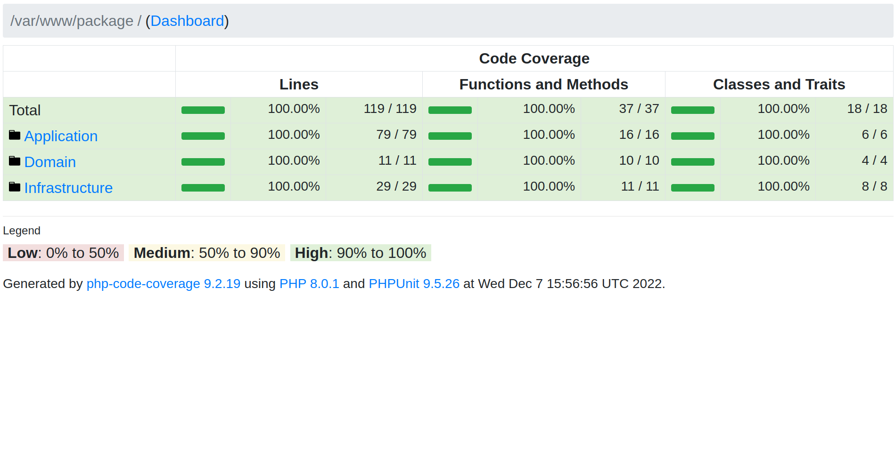

# OrderProject
This project is built on laravel 9
______________________________________________________________
# How It Works?

1- git pull "branch_url"

2- checkout the master branch

3- go to **_src_** folder and run "composer install"

4- in the root folder run "docker-compose up -d --build" and this will init the project and build the containers.

5- go to container bash by command "docker exec -it php-app  /bin/bash" and execute inside the container these commands:

chmod -R 777 storage/
php artisan cache:clear
php artisan migrate:fresh
php artisan db:seed

6 The most important step is to copy src/.env.example to src/.env and add you Mysql configuration such as username and password also in main .env.example in the main root to .env and change also the params. anyway i made default values you can use it.
________________________________________________________________

# How can we hit the api endpoint to make new order?

you can hit it from any client and hit the url:
"http://localhost:8060/api/v1/order"

with body:
{
"products": [
{
"product_id": 1,
"quantity": 2
}
]}

- for sure, you can change the body as you need.

__________________________________________________________________
# The flow:

### **_`Important Note: All the Logic is inside src/order-package`_**

1- The controller take the request in src/order-package/Application/Controller/OrderCreationController.php

2- Controller will call a service src/order-package/Application/Service/Order/OrderCreationService.php

3- This service is calling other services to make the order and order products and update the stock.

4- If the order is created successfully, so it will return 201 with response for example {"orderId":5}.

5- If the order isn't created due to data validation error ,so it will return 400.

5- If the order isn't created because we haven't enough ingredients in stock to make the order ,so it will return 422. 

5- If the order isn't created because of server error ,so it will return 500. 
_____________________________________________________________________

# The Architecture

src/order-package has three main folders

1- Application:
   this has the Controllers and Services

2- Domain:
   this has the domain models (something like DTO but have differences) and also has the ValueObjects

3- Infrastructure:
   this has Mysql Models and Repositories needed to make the application layer for accessing database and this called only from the services.

- We also have some bindings inside src/app/Providers/RepositoryServiceProvider.php.

___________________________________________________________________________
# Database:
1- products table => this table for products data
      id
      name

2- order_product table => it is pivot table for orders and products many-to many relation
    order_id     
    product_id
    product_quantity

3- ingredients table => to store ingredients data
    id
    name
    current_quantity
    in_stock_quantity
    notification_sent

3- product_ingredient table => it is pivot table for products and ingredients many-to many relation
    product_id
    ingredient_id
    ingredient_quantity
_____________________________________________________________________________

# Testing:

- The test cases is on src/tests and is cover 100% of the cases in order-package, and contain both unit and feature tests.

- Go to container  by "docker exec -it php-app  /bin/bash"

- Run "./vendor/bin/phpunit --coverage-html order-package" so you can run the tests and with the coverage html.

- After run last test command "coverage-html" you can see also see the coverage in report in "src/reports/coverage/index.html" ,so if you run this file in browser you can see the coverage. and it is 100%

_________________________________________________________________________________
# Technical patterns in the project:

- The project is using always bulk update if there is any update which has possibility of update more than one entity.

- The project uses domain model in some places, so we can manipulate the data and encapsulate it before using it anywhere.

- Also, to build the domain model it will use value object to build domain model properties and serialize it well.

- Also, the project used here the transaction to make sure all database operations are done together or fail together, so I can assure data consistency.

- Also, the project is using event-listener (observer pattern) so if the ingredient stock is below 50% it will fire event so listener can send the email and mark notification_send in database to 1 to not send again email regarding this ingredient and this is done with calling "src/order-package/Application/Service/Ingredient/IngredientService.php". from 
"src/app/Listeners/NotificationForIngredientBelowHalfInSockListener.php"
__________________________________________________________________________________________

# Things to do in the future

1- We need to use locking for the ingredients table, so we can assure that not two transaction is using the same lock but here we can also solve this by make the transaction isolation level to be (**serialization anomaly**). so we can assure ACID and specially data isolation and consistency.

2- We need to integrate with third party, so we can send our mail through it (in our case send email to notify if the ingredients is below 50%).

3- We need to consider cs-fix, so we can assure good standards in code.

4- We need to use data provider in our test cases, so we shouldn't make a lot of code in the test with each test case data.

5- We can send the emails via job queue run every 1 hour but we should scan the full ingredients table every 1 hour and may be valid because it is run after one hour.
